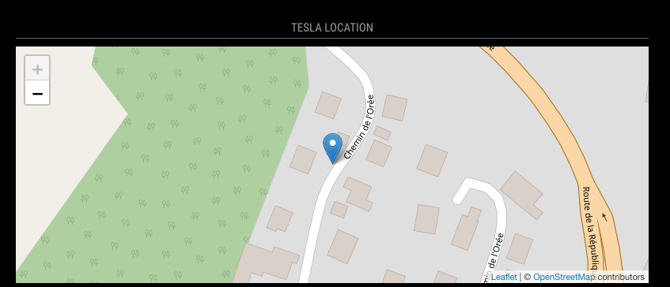

# Teslamate Location

This is a [MagicMirror](https://github.com/MichMich/MagicMirror/) module showing a map
with a marker where your Tesla is currently located. It uses MQTT to receive this
information from [TeslaMate](https://github.com/adriankumpf/teslamate) (so this is required!)
and shows it on a [Leaflet](https://leafletjs.com/) map.



## Installation

Go to `MagicMirror/modules` and write

```
    git clone https://github.com/donker/MMM-TeslamateLocation
    cd MMM-TeslamateLocation
    npm install
```

## Configuration

Here is an example configuration with description. Put it in the `MagicMirror/config/config.js` file:

```javascript
{
    module: 'MMM-TeslamateLocation',
    position: 'top_right',
    header: 'Tesla Location',
    config: {
        height: "300px";
        width: "100%";
        zoomLevel: 20;
        mqttServerAddress: '000.000.000.000',
        mqttServerPort: '1883',
        // mqttServerUser: '',
        // mqttServerPassword: '',
        mqttTopic: "teslamate/cars/1"
    }
},
```

The height and width are used to set the containing div's size. The Leaflet map attempts to fill this div
entirely. The higher the zoomLevel, the more detail you'll see on the map. Finally, the topic is the path
to the car's MQTT output. The module appends "/latitude" and "/longitude" to this string to get the topics
for the car's location.
